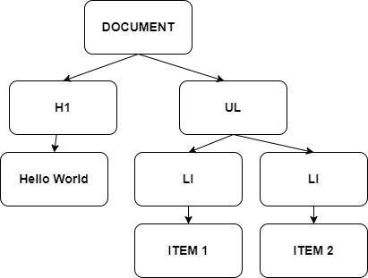

# O que é o React?

React é uma biblioteca para criar interfaces com o usuário. Essa definição está em destaque no site oficial do React e indica muito bem o seu propósito. React não é um framework completo. React não lida com roteamento ou renderização no servidor. React tem um e um único propósito: criar interfaces com o usuário.

React faz isso de forma declarativa e em uma estrutura baseada em componentes. Programação declarativa é aquela onde dizemos o que deve ser feito, sem necessitar especificar como deve ser feito. Isso torna um programa mais fácil de ser lido, escrito e atualizado. Assim, o React abstrai muito de sua funcionalidade para o programador.

Componentes são pequenas partes da interface com o usuário que podem ser reutilizadas dentro do projeto, ou mesmo em outros projetos. Dividir um projeto em componentes é como trabalhar uma estrutura de lego; componentes são como peças que podemos utilizar para criar a estrutura maior que desejamos. Indo além de Lego, é possível criar novos componentes que sirvam a nosso propósito.

O coração do React está em seu DOM virtual. Para entendermos o DOM virtual, vamos recordar o que é o DOM.

## O DOM

O **DOM** é um acrônimo para **D**ocument **O**bject **M**odel, ou modelo de objetos do documento. É uma árvore estruturada contendo todos os elementos de uma página HTML. O navegador utiliza o DOM para renderizar a página que estamos vendo.

Digamos que tenhamos um página HTML simples, como abaixo.

```html
<body>
    <h1>Hello World</h1>
    <ul>
        <li>Item 1</li>
        <li>Item 2</li>
    </ul>
</body>
```

O navegador irá interpretar o código acima e utilizá-lo para criar uma árvore de elementos, como na figura abaixo.



Podemos entender o código HTML como uma planta para a criação do DOM. Uma vez que o navegador criou o DOM baseado na HTML, somente é possível modificá-lo utilizando um script como JavaScript.

Items do DOM são também chamados de **nós** e podem ser elementos HTML ou textos. Podemos alterar propriedades de um elemento HTML como no exemplo abaixo, escrito em JavaScript.

```JavaScript
document.getElementById("root").style.color = 'red'
```

O propósito de JavaScript é alterar o DOM diretamente. Em React, trabalhamos com o DOM virtual.

> JavaScript foi criado originalmente para ser um script utilizado em navegadores. Ou seja, seu propósito inicial era unicamente manipular o DOM. Atualmente, é possível utilizar JavaScript fora de navegadores.

## O DOM virtual

O DOM virtual é uma representação do DOM que vive na memória. Ele funciona como uma planta arquitetônica do DOM verdadeiro. O DOM virtual é construído e manipulado por React e o navegador não interage diretamente com ele. No fundo, o DOM virtual é um grande objeto JavaScript. 

Quando utilizamos React, devemos fazer um acordo com ele. Nós garantimos que não vamos interagir com o DOM diretamente, mas sim com o DOM virtual. E o React garante que ele irá atualizar o DOM a partir do DOM virtual da forma mais eficiente possível.

Em React, diferentemente de JavaScript, nós manipulamos elementos do DOM virtual. A maior vantagem disso é que React é uma biblioteca que otimiza a atualização do DOM, modificando apenas os elementos necessários, quando necessário.

Quando atualizamos o DOM virtual, o React é capaz de comparar o DOM virtual alterado com o antigo, calcular a diferença exata e modificar o DOM apenas no que for necessário. Com isso, o React é eficiente e nos permite trabalhar de forma declarativa.

