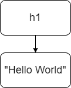
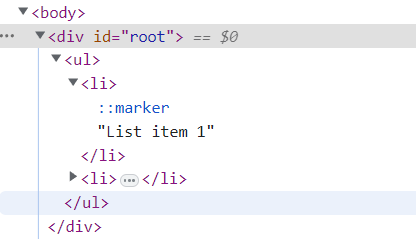

# A árvore do DOM virtual

O DOM virtual também é estruturado em forma de árvore, assim como o DOM. A diferença é que seus elementos são objetos JavaScript e vivem na memória, mas não precisamos nos preocupar com isso. Em nosso primeiro exemplo, a estrutura era muito simples, pois só havia um elemento com apenas um filho. Vamos lembrar este elemento.

```JavaScript
React.createElement('h1', null, 'Hello World')
```
Podemos ver tal estrutura na figura abaixo.



Em um projeto React real, essa estrutura é muito mais complexa. Teremos elementos React dentro de elementos React, criando uma árvore estrutura similar ao DOM.

Vamos ver um segundo exemplo, de uma estrutura com múltiplos elementos React. Vamos começar com a listagem abaixo.


```JavaScript
let root = ReactDOM.createRoot(document.getElementById("root"))
let listItem1 = React.createElement("li",null,"List item 1")
let listItem2 = React.createElement("li",null,"List item 2")
let list = React.createElement("ul",null,listItem1,listItem2)
root.render(list)
```

A primeira linha já é conhecida, ela estabelece a raiz para a renderização do DOM. Depois, três elementos React são criados. Note que o terceiro elemento possui 4 argumentos; o terceiro e o quarto são filhos do elemento criado.

Até o momento, havíamos criado elementos React apenas com um filho, porém elementos React podem ter diversos filhos e aceitam também arrays como filhos. Isso nos permite criar uma estrutura em forma de árvore. Podemos ver a estrutura de elemtnos HTML criados na figura abaixo.



O método `createElement` possui a seguinte expressão.

```JavaScript
React.createElement(\textbf{tipo}, \textbf{props}, ...\textbf{filhos})
```
O primeiro argumento é o tipo de componente React a ser criado, seguido por suas propriedades e por seus filhos. As propriedades devem ser passadas como um objeto ou com o valor nulo. Os filhos são opcionais. 

## Não altere o DOM direramente

O título dessa seção é bem clara. **Não altere o DOM diretamente**. Deixe o React cuidar disso. Lembre-se do acordo que você fez com ele. Você trabalha com o DOM virtual e deixa o React lidar com o DOM.

O motivo disso é que o React compara a nova versão do DOM virtual com a versão antiga, calcula a diferença, e faz as alterações no DOM necessárias para mantê-lo em sincronia com DOM virtual. Se você alterar o DOM diretamente, o React não terá conhecimento disso e pode não fazer as alterações de forma correta.