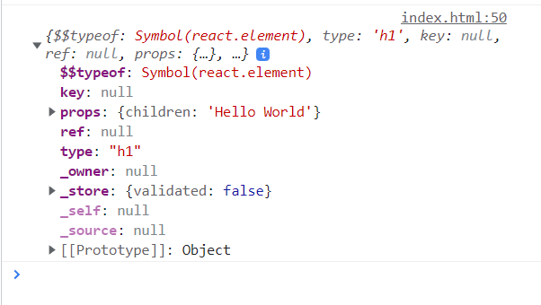
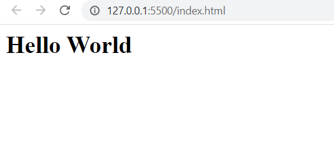

# Elementos React

O DOM é composto de elementos HTML. O DOM virtual é composto de elementos React, que são objetos JavaScript. Deixamos a cargo de React transformar seus elementos em elementos do DOM. Para que ele possa fazer isso, porém,  precisamos criar elementos React. Isso é feito com o método `createElement` da biblioteca `React`. Vamos ver um exemplo. Vejamos o seguinte *script*.

```JavaScript
let meuH1 = React.createElement("h1",null,"Hello World")
console.log(meuH1)
```

O método `createElement` aceita uma quantidade arbitrária de argumentos. O primeiro indica o tipo de elemento React que queremos criar. No caso, será um elemento do tipo `h1`. O segundo argumento são as propriedades de tal elemento, que se relacionam com os atributos do elemento HTML. A princípio tal elemento não terá propriedades, então passamos o valor nulo (`null`). Finalmente, dizemos quais serão os filhos do elemento. No caso acima, ele terá apenas um filho, que será um texto de valor `Hello World`.

Na segunda linha, ordenamos que o elemento React seja exibido no console. Vejamos o resultado na figura abaixo.



Podemos ver que elementos React são objetos JavaScript. Eles não são elementos do DOM, mas elementos do DOM virtual. 

Agora, vamos indicar para o React transformar tal elemento do DOM virtual em um elemento do DOM. Já vimos que esse é o propósito da segunda biblioteca, ReactDOM. Vejamos o código abaixo.

```JavaScript
let root = ReactDOM.createRoot(document.getElementById("root"))
root.render(meuH1)
```

O primeiro passo é indicar qual será a raiz do DOM virtual; onde ele será inserido (renderizado). Para isso utilizamos o método `createRoot` do objeto `ReactDOM`, que recebe como argumento o elemento do DOM que será a raizz do projeto. No caso acima, será o elemento com id `root`.

> É comum a raiz dos projetos React ser uma `div` com **id** de `root`. Essa escolha não é obrigatória, mas uma convenção. 

Depois de criar a raiz, utilizamos o método `render` para renderizar o elemento React que criamos anteriormente. Caso tal elemento possua descendentes, tais descendentes serão renderizados também. É por isso que devemos renderizar o elemento raiz da árvore do DOM virtual. O resultado final pode ser visto na figura abaixo.




