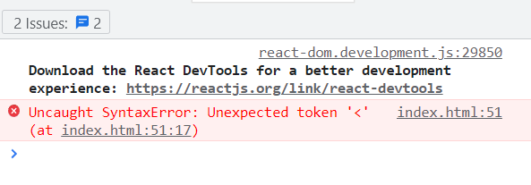
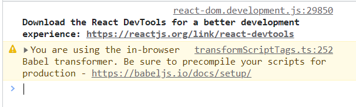

# JSX

Elementos React são criados através do método `createElement`, porém estruturar uma hierarquia de elementos desta forma é difícil e trabalhoso. Por isso, os engenheiros do Facebook desenvolveram uma linguagem de marcação própria para React, chamada de **JSX**.

> É importante entender que JSX não é uma biblioteca ou um framework, mas uma linguagem de marcação.

JSX significa JavaScript **XML**, ou JavaScript E**X**tensible **M**arkup **L**anguage. Assim como HTML é uma marcação para a criação de elementos HTML, JSX é uma marcação para a criação de elementos React. É preciso alguma ferramenta para transformar de JSX para elementos React, e essa ferramenta é uma biblioteca chamada **Babel**.

## Babel

A ideia de JSX é facilitar o desenvolvimento de aplicações React. Vamos imaginar que queiramos uma estrutura de elementos React da seguinte forma.

```JavaScript
let li1 = React.createElement("li", null, "Item 1")
let li2 = React.createElement("li", null, "Item 2")
let li3 = React.createElement("li", null, "Item 3")
let ul = React.createElement("ul", null, li1, li2, li3)
```

A estrutura acima é muito simples, apenas uma lista com 3 elementos. No entanto, para escrevê-la como elementos React, é muito trabalhoso. Seria melhor que pudessemos escrever os elementos acima da seguinte forma.

```JavaScript
let ul = <ul><li>Item 1</li><li>Item 2</li><li>Item 3</li></ul>
```
A marcação acima é muito mais fácil de ler, e é exatamente como funciona JSX. Apesar de parecer, a marção acima não é HTML. Ela está diretamente atribuída à uma variável JavaScript. No entanto, o navegador não entende JSX. Caso tentemos fazer essa declaração no navegador, ele irá indicar um erro.



Como já disse, quem tem a missão de interpretar JSX é o Babel e não o React. Para isso, precisamos utilizar essa biblioteca. Inicialmente, vamos utilizar Babel diretamente no navegador. Essa não é a forma correta de utilizar Babel em produção, porém por agora estamos apenas utilizando como aprendizado.

Babel pode ser obtida em seu site oficial, [babeljs.io](http://babeljs.io), ou em algum CDN. Um endereço de CDN onde Babel está atualmente disponível é o seguinte.

[https://unpkg.com/@babel/standalone/babel.min.js](https://unpkg.com/@babel/standalone/babel.min.js)

Precisamos incluir essa biblioteca em nosso projeto. Além disso, devemos indicar que o script contido no projeto deve ser interpretado por Babel e não por JavaScript. Fazemos isso na propriedade `type` da marcação `script`. Vamos juntar todo o código na listagem abaixo.

```JavaScript
<script src="https://unpkg.com/@babel/standalone/babel.min.js"></script>
<script type="text/babel">
    let root = ReactDOM.createRoot(document.getElementById("root"))
    let lista = <ul><li>Item 1</li><li>Item 2</li><li>Item 3</li></ul>
    root.render(lista)
</script>
```
   
Isso irá funcionar, e os elementos React criados foram declarados de forma bem mais simples. No entanto, o navegador irá indicar um erro no console, como podemos ver na figura abaixo.



Devemos utilizar o Babel antes de enviarmos os arquivos para o navegador. Em outras palavras, devemos usar o Babel como um pré-compilador.
