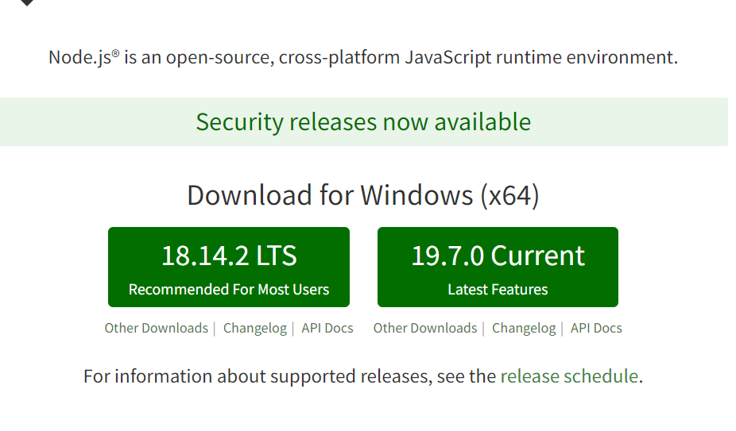
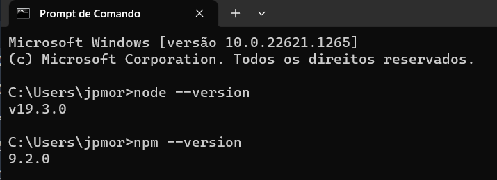
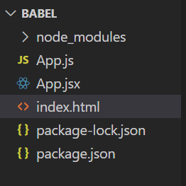

# Pre-compiladores

Pré-compiladores fazem a compilação (ou transpilação) de uma linguagem em outra previamente. A diferença entre compilação e transpilação não nos interessa muito, apenas a ideia de que estamos transformando um código em outro, seja na mesma linguagem ou para uma linguagem diferente.

Um exemplo de pré-compilação é **SASS**, ou **S**yntactically **A**wesome **S**tyle **S**heets, que é uma espécie de CSS com super-poderes. É uma forma de escrever folhas de estilos que vai além de puro CSS. Porém o navegador não entende SASS, apenas CSS, de forma que precisamos transformar SASS em CSS antes de enviar para o navegador. Isso é a pré-compilação.

No caso da React, precisamos transformar JSX em puro JavaScript. Vamos ver como fazer isso utilizando Babel. Para começar, vamos alterar o nosso arquivo HTML para executar um JavaScript puro, que ainda vamos criar.

```html
<!DOCTYPE html>
<html lang="en">
  <head>
    <script crossorigin src="https://unpkg.com/react@18/umd/react.development.js"></script>
    <script crossorigin src="https://unpkg.com/react-dom@18/umd/react-dom.development.js"></script>
  </head>
  <body>
    <div id="root"></div>
  </body>
  <script src="./App.js"></script>
</html>
```

Vamos agora criar o arquivo que iremos transformar de JSX para JavaScript. Por questão de simplicidade, ele pode ser criado na raiz, com o nome de `App.jsx`. Você não precisa se preocupar com boas práticas de como criar tal arquivo, em vista que em breve vamos utilizar ferramentas para criar aplicações React, e tais ferramentas farão toda essa configuração por nós. Por enquanto, estamos apenas entendendo os conceitos.

O código do arquivo `App.jsx` é bem simples. Veja a lista abaixo.

```JavaScript
const raiz = React.createRoot(document.getElementById("root"))
const Lista = <ul><li>Item 1</li><li>Lista 2</li></ul>
raiz.render(Lista)
```
Para executarmos o Babel, antes temos que falar sobre o **Node.js** e o **npm**.

## Node Js e npm

Node.js, ou apenas Node, é um ambiente de execução JavaScript fora de navegadores. Em termos gerais, é um ambiente onde podemos executar programas escritos em JavaScript. 

***NPM***, **N**ode **P**ackage **M**anager, é um gerenciador de pacotes (bibliotecas, módulos) para o Node. Ele é um software independente do Node, porém é instalado quando instalamos Node. Assim, para instalar o Node e o npm, basta instalar o Node.

Para isso, é necessário acessar o site [nodejs.org](http://nodejs.org) e clicar no botão de Download para seu sistema operacional, como mostrado na figura abaixo. Você pode instalar tanto a versão de suporte a longo termo, LTS, ou a corrente. Você pode aceitar todos os valores por padrão.




Para certificar-se que o Node foi corretamente instalado no seu sistema operacional, basta executar o seguinte comando em qualquer **shell**. Se você não tiver familiaridade com shell, e estiver utilizando Windows, pode utilizar o prompt de comando.  

Nele, basta executar o seguinte comando:

```bash
> node --version
```

Se o Node tiver sido instalado corretamente, alguma versão será mostrada. O mesmo vale para o npm, como podemos ver na figura abaixo.



Agora podemos iniciar um novo projeto Node, instalar e executar o Babel.

## Utilizando o babel

O primeiro passo é iniciar um projeto Node, com o comando a seguir.

```shell
> npm init -y
```

Isso irá criar dois arquivos de configuração, sendo `package.json` o mais importante. Agora podemos instalar o Babel. Como iremos utilizar o Babel em React, podemos instalar o preset de React, com o comando a seguir.

```shell
> npm install --save-dev @babel/preset-react
```

Iremos utilizar o Babel pela linha de comando. Para isso, precisamos instalar o pacote **cli** do Babel, como a seguir.

```shell
> npm install --save-dev @babel/cli@7
```

Agora estamos prontos para transformar o JSX para JavaScript. A seguinte linha de comando irá funcionar.

```shell
> npx babel --presets @babel/preset-react App.jsx -o App.js
```

O arquivo `App.jsx` será transformado em `App.js`, como podemos ver na figura abaixo.



Agora nossa página irá executar sem problema, porque ela utiliza apenas HTML e JavaScript, o que o navegador entende. Uma olhada rápida pelo arquivo JavaScript gerado, encontramos o seguinte.

```JavaScript
const raiz = ReactDOM.createRoot(document.getElementById("root"));
const Lista = /*#__PURE__*/React.createElement("ul", null, /*#__PURE__*/React.createElement("li", null, "Item 1"), /*#__PURE__*/React.createElement("li", null, "Lista 2"));
raiz.render(Lista);
```

Note que agora utilizamos apenas o objeto React, com o método para criar elementos React, *createElement*.